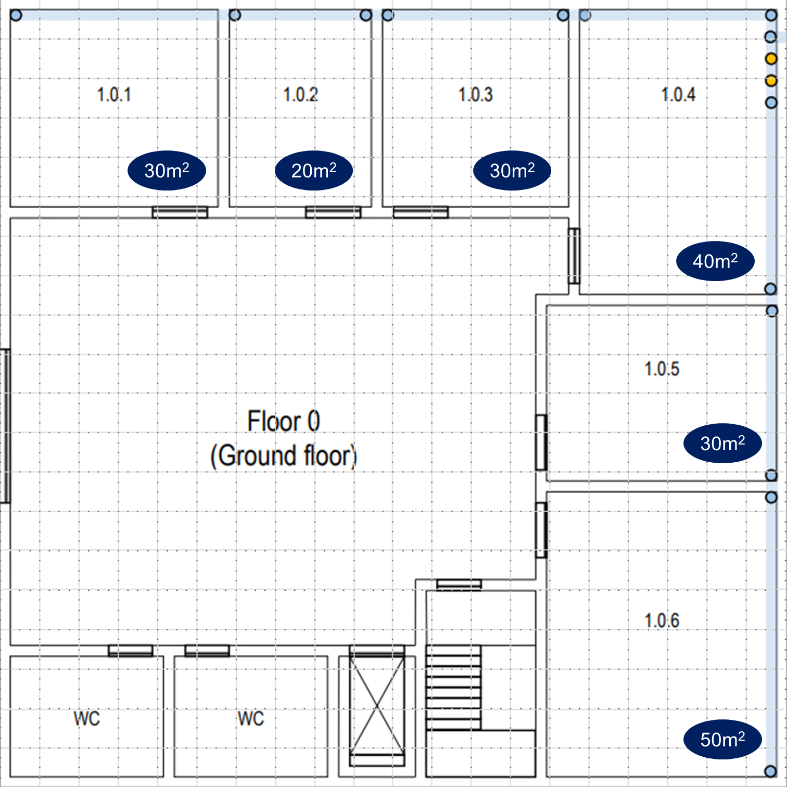
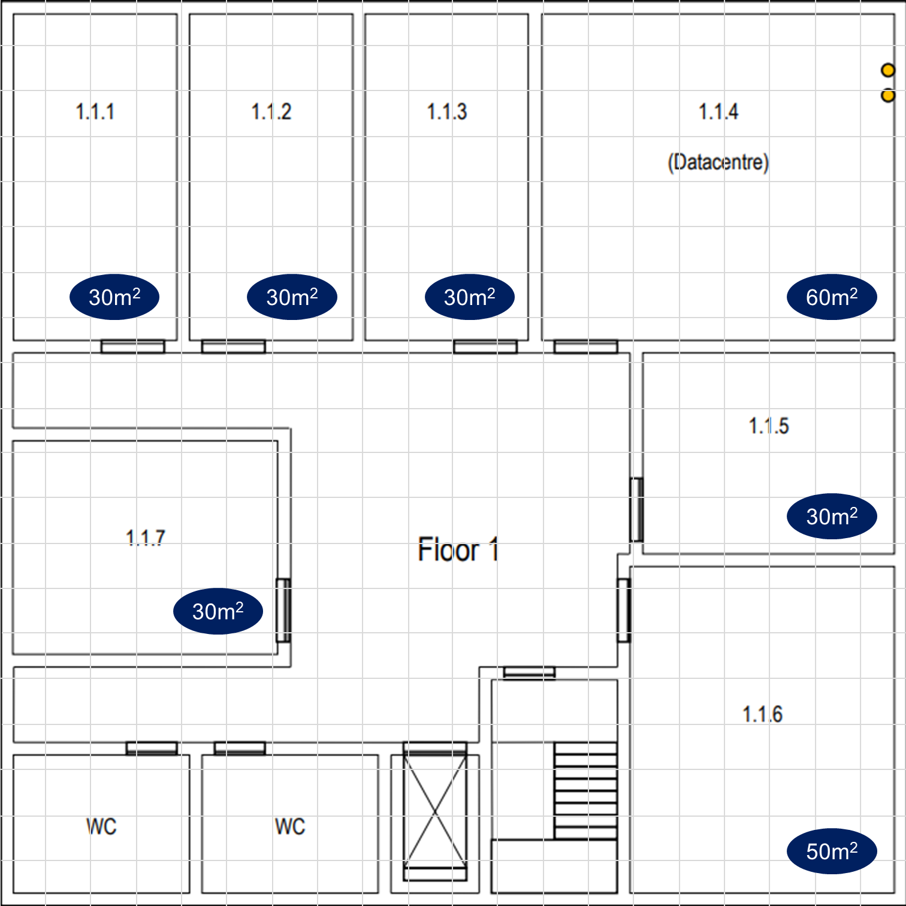

# EDIFÍCIO 1

## MEDIÇÃO DAS SALAS

O edifício 1 apresenta 20m de comprimento por 20m de largura (20 x 20). Cada célula representada em ambos os planos possui uma área de 1m^2.

Como se pode ver, muitas das salas não sao abrangidas, na sua totalidade, por células integrais, portanto houve a necessidade de se fazer arredondamentos (por excesso, nesse caso).

Em consideração à regra que estabelece 2 tomadas por cada 10m^2, as estimativas foram feitas da seguinte forma (o seguinte raciocínio foi aplicado tanto para o eixo vertical como horizontal, uma vez que a área do rectângulo calcula-se multiplicando a base pela altura, ou seja, dimensão horizontal vezes a dimensão vertical):
> -  somamos o comprimento do máximo de células integrais possíveis

> - no caso de haverem células parciais, ponderamos, com base na nossa percepção a olho nu, se valia a pena ou não considerá-las como uma célula integral a acrescentar ao cálculo. Ou seja, se a olho nu percebemos que metade ou mais da célula faz parte do comprimento da sala, então aceitamos essa célula na sua integridade para o cálculo do comprimento. Por exemplo, se na horizontal tivermos 5 células (integrais) e mais de 50% de mais uma célula (deduzido a olho nu), por se tratar de 50% ou mais, aceitamos essa célula na sua totalidade e aproximamos a medição para 6 células (que representam 6m).
>
> **OBS:** nos casos em que, que por exemplo, na medição vertical sobra uma parte duma célula mas a percentagem é pequena (menos de metade duma célula completa) de modo que não justifique a sua consideração, se na medição horizontal também sobrar parte duma célula, as duas porções parciais são agregadas constituindo mais um metro (pode ser mais um metro na vertical ou horizontal, não importa).

> - depois de feitas as medições (com base nos aspetos anteriores), calculamos a área da sala e esta é arredondada por excesso para múltiplos de 10, uma vez que as boas práticas de cabelagem indicam 2 tomadas por cada 10m^2. Ou seja, se a área resultante for maior que 20m^2 (24, 25... por exemplo) assume-se como 30m^2, sendo necessárias 6 tomadas.

### PISO 0

### PISO 1

