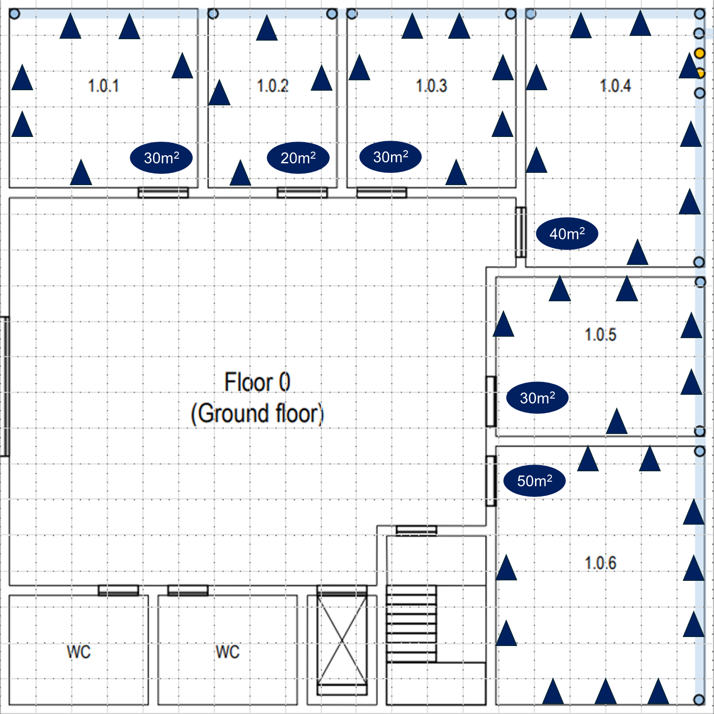
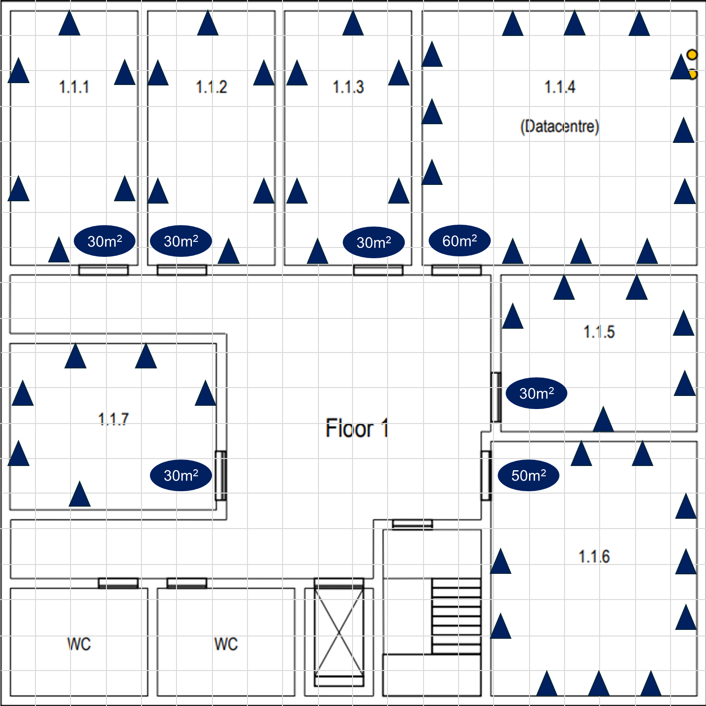

# EDIFÍCIO 1

## POSICIONAMENTO DAS TOMADAS

Como dito anteriormente, usamos a relação de 2 tomadas por cada 10m^2 para determinar a quantidade de tomadas por sala.

**OBS:** assumindo que as portas abrem apontando para o interior das salas, as zonas atrás das portas foram desprezadas, presumindo que ninguém vai instalar equipamentos atrás de portas.

### PISO 0

### PISO 1

## ACCESS-POINTS

Em um espaço vazio, sem paredes ou outras barreiras para o sinal wireless, a cobertura dum único access-point posicionado no centro do edifício seria aproxidamente como descrita pela imagem seguinte:

Em tais condições um único access-point era mais do que necessário, mas não sendo esse o caso, e como não conseguimos presumir com exatidão qual será o prejuízo sofrido pelo sinal, assumimos uma atenuação de cerca de 50% da potência do sinal devido às paredes. Embora a área coberta por access-points é esférica, assumimos que o sinal não transita dum piso para o outro devido à alta resistência que o teto oferece à propagação do sinal. 

A localização de cada access-point foi determinada tendo em especial atenção a cobertura que estes conjuntamente ofereceriam às salas, que são as nossas workstations. Vale lembrar que a cobertura apresentada, representa o alcance do sinal quando reduzido a 50%, portanto a cobertura real pode ser maior.

Os access-points estão representados pelos triângulos verdes, no centro de cada círculo. Os access-points estão posicionados alguns metros acima do chão e as tomadas para os alimentar encontram-se abaixo destes.

### PISO O

### PISO 1

