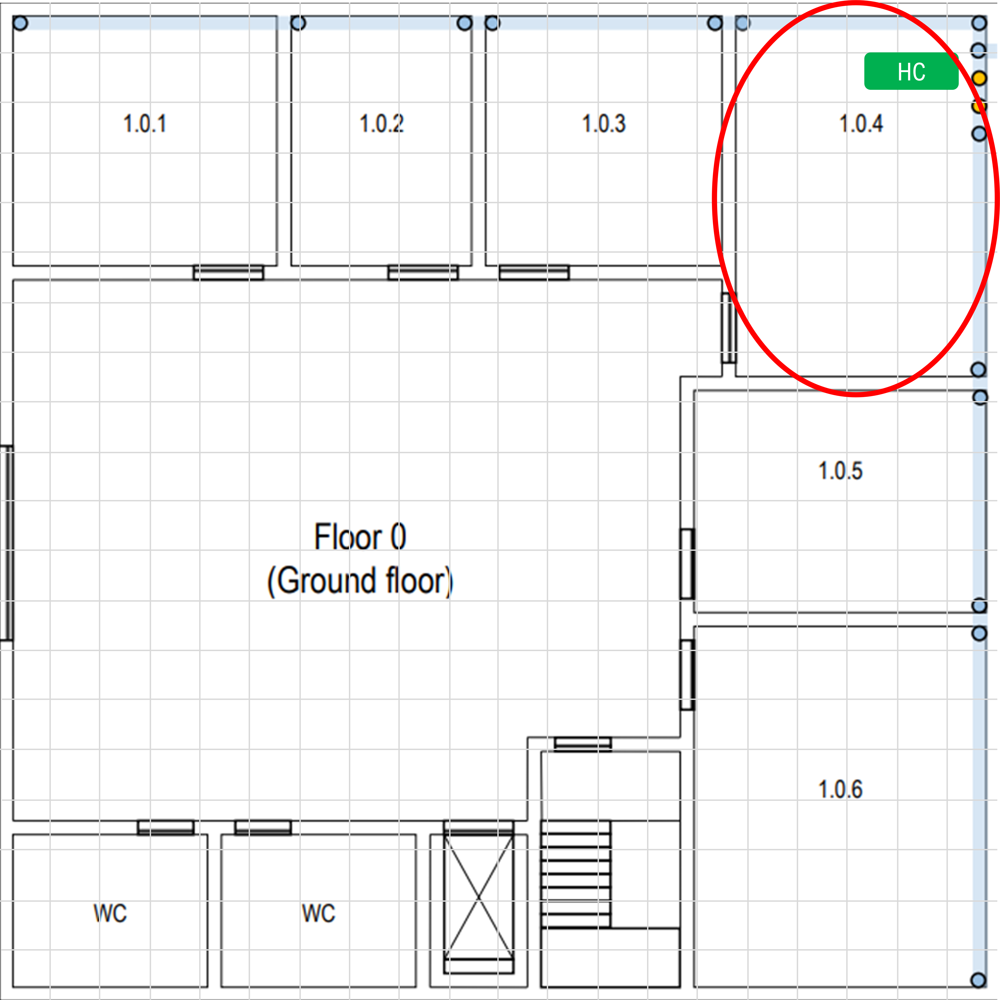
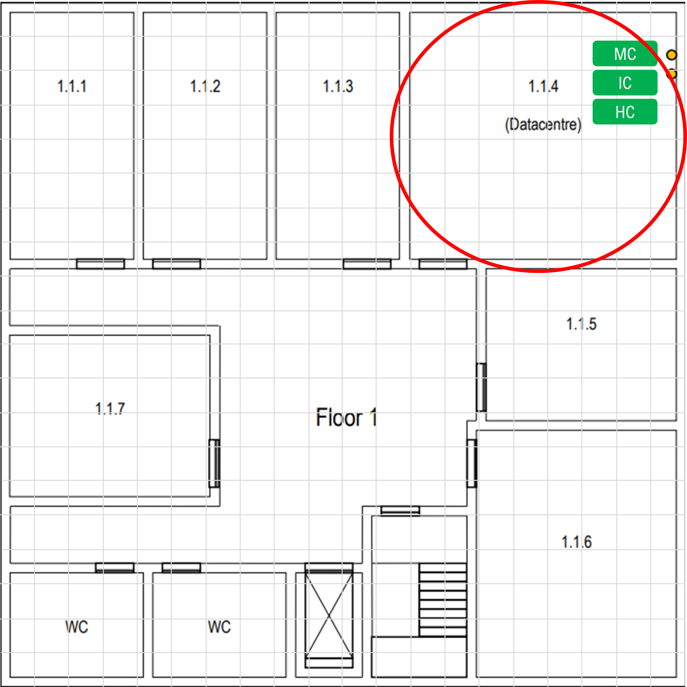

# EDIFÍCIO 1

## POSICIONAMENTO DOS CROSS-CONNECTS

### PISO 0

O piso 0 alojará um horizontal cross-connect (HC) apenas, e decidimos que será na sala 1.0.4 pelo fato de ser a sala que está mais "no meio" das restantes que precisam ser servidas pela rede de cabeamento, para além de que está mais próxima do main cross-connect (MC) que será alojado no datacenter do piso 1.

### PISO 1

O piso 1 alojará, no datacenter (sala 1.1.4), um MC, um intermediate cross-connect (IC) e um HC. Esta sala também está convenientemente mais "no meio" das restantes.

> Cada conexão entre os cross-connects será feita com 8 cabos de fibra ótica, ou seja, os IC's de cada edifício serão conectados ao MC por 8 cabos de fibra ótica cada e cada HC do edifício 1 também será conectado ao respetivo IC por 8 cabos cada.