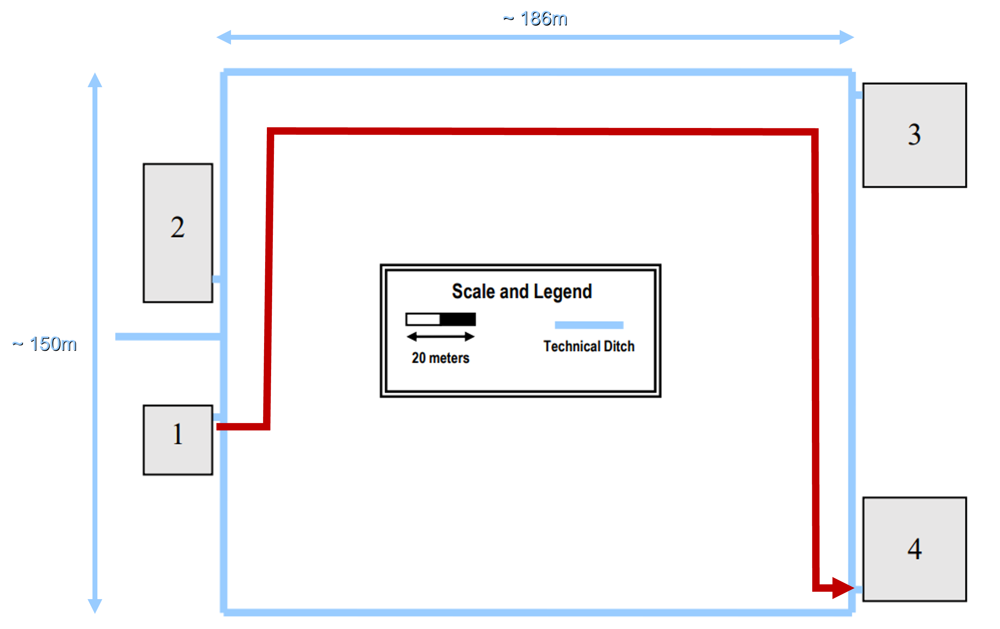

# BUILDING 1

## CAMINHOS DOS CABOS

A fim de simplificar a medição e a representação da rede de cabeamento, uma vez que os cross-connects do piso 1 estão concentrados na sala datacenter e o HC do piso 0 está numa sala imediatamente abaixo do datacenter (ou seja, os cabos backbone que servem o edifício 1 basicamente descem dum piso para o outro), vamos apenas considerar a distância percorrida pelos cabos dum piso para o outro e acresentar mais 2 metros para "compensar" a distância percorrida da parede até aos patch-panels;

Para entender melhor o planeamento, vamos primeiro falar sobre o piso 1, que é onde está o MC e onde inicia a nossa rede.

### PISO 1

- No ponto 1 (vermelho) da ilustração é por onde vão passar os cabos que saem do IC para o HC do piso abaixo
- O ponto 2 (azul escuro) representa o ponto onde os cabos sobem para o teto caído para percorrerem o piso em direção ás salas
- Os pontos restantes (azul claro) representam os pontos onde os cabos descem do teto caído para alimentar as tomadas. Os vários cabos que vão alimentar as várias tomadas duma sala descem todos num mesmo ponto do espaço, e depois cada cabo segue a sua trajetória a uma distância de cerca de 0.5m acima do chão (2m abaixo do teto caído).

### PISO 0

- O ponto 1 é por onde descem os cabos que procedem do piso 1, para se conectarem ao HC
- O ponto 2 é o ponto de passagem dos cabos que alimentam o resto dos edifícios
- O ponto 3 é onde os cabos de cobre entram na passagem sob o piso para fazer o horizontal cabling
- O resto dos pontos (azul claro) representam os pontos de saída dos cabos, antes dentro da passagem sob o piso, para se ligarem às tomadas

## CABEAMENTO ENTRE EDIFÍCIOS

Os cabos que irão fazer a conexão entre o MC no edifício 1 e os IC nos restantes edifícios seguirão a seguinte trajetória:

A distância da trajetória maior é de aproximadamente 427m, portanto fibra ótica multimode será suficiente.

### TIPOS DE CABOS

Sendo assim, todo o cabeamento backbone (no interior do edifício 1 e entre os edifícios) será com **fibra ótica multimode**, enquanto todo o cabeamento horizontal do edifício 1 será implementado com cabos de **cobre CAT7**.
