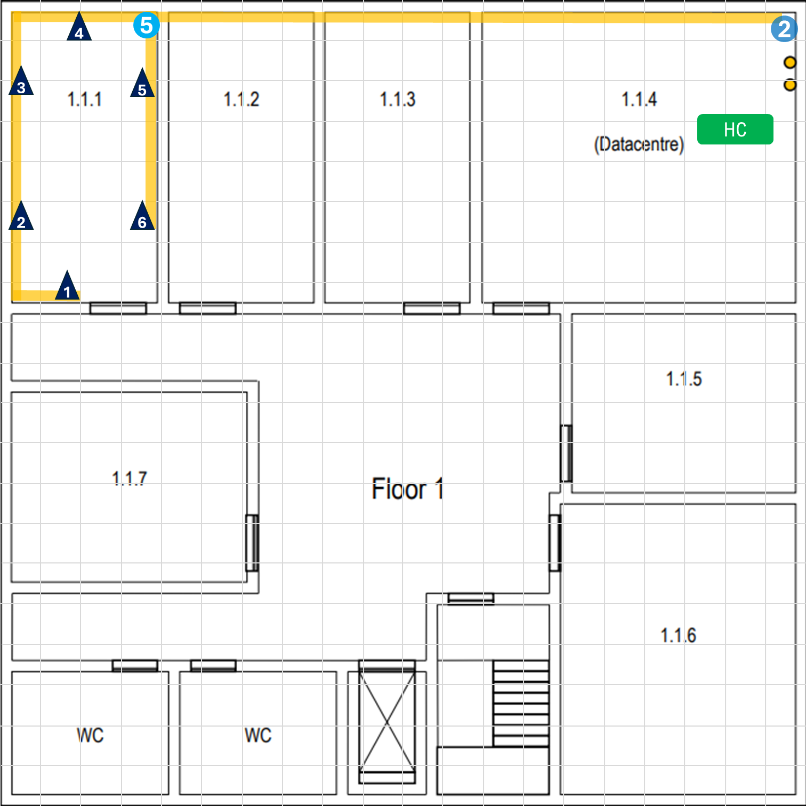

# EDIFÍCIO 1

## INVENTÁRIO

Para facilitar a explicação enumeramos as tomadas e quando pretendermos fazer menção ao cabo que se ligará a uma dada tomada, referi-lo-emos através do número associado à tomada, ou seja, o cabo que liga á tomada 1 será designado de cabo 1, por exemplo.

Todas as tomadas estão posicionadas a **0.5m acima do chão**.

O tamanho total de cada cabo será igual a T0 (representa a distância comum a todos os cabos duma mesma sala) mais os respetivos acréscimos.

**OBS:** as circunstâncias não nos permitem realizar uma medição exata, pelo que os cálculos apresentados representam aproximações e estimativas deduzidas a olho nu.

### PISO 0

#### SALA 1

Todos os cabos da sala 1 seguem os seguintes passos:
- A - percorrem praticamente 20m do ponto 3 até ao ponto 6
- B - saem da passagem sob o piso e sobem 0.5m

T0 = (A + B) * (quantidade de cabos/tomadas) = (20 + 0.5) * 7 = 143.5m

Os valores apresentados a seguir representam as distâncias adicionais que cada cabo percorre até à respetiva tomada:

> - **Cabo 1**: + 7.5m
> - **Cabo 2**: + 4m
> - **Cabo 3**: + 2m
> - **Cabo 4**: + 2m
> - **Cabo 5**: + 4m
> - **Cabo 6**: + 7m
> - **Cabo 7**: + 8m
>
> **T1** (total da sala 1) = T0 + C1 + C2 + C3 + C4 + C5 + C6 + C7 = 143.5 + 7.5 + 4 + 2 + 2 + 4 + 7 + 8 = 178m

#### SALA 2

Todos os cabos da sala 2 seguem os seguintes passos:
- A - percorrem praticamente 11m do ponto 3 até ao ponto 5
- B - saem da passagem sob o piso e sobem 0.5m

T0 = (A + B) * (quantidade de cabos/tomadas) = (11 + 0.5) * 4 = 46m

##### Distâncias adicionais percorridas até à respetiva tomada:

> - **Cabo 1**: + 2.5m
> - **Cabo 2**: + 2m
> - **Cabo 3**: + 6.5m
> - **Cabo 4**: + 9.5m
>
> **T2** = T0 + C1 + C2 + C3 + C4 = 46 + 2.5 + 2 + 6.5 + 9.5 = 66.5m

#### SALA 3

Todos os cabos da sala 3 seguem os seguintes passos:
- A - percorrem praticamente 6m do ponto 3 até ao ponto 4
- B - saem da passagem sob o piso e sobem 0.5m

T0 = (A + B) * (quantidade de cabos/tomadas) = (6 + 0.5) * 6 = 39m

##### Distâncias adicionais percorridas até à respetiva tomada:

> - **Cabo 1**: + 6.5m
> - **Cabo 2**: + 3m
> - **Cabo 3**: + 1.5m
> - **Cabo 4**: + 2m
> - **Cabo 5**: + 3.5m
> - **Cabo 6**: + 6m
>
> **T3** = T0 + C1 + C2 + C3 + C4 + C5 + C6 = 39 + 6.5 + 3 + 1.5 + 2 + 3.5 + 6 = 61.5m

#### SALA 4

Estes cabos encontram-se na mesma sala que o HC, logo não precisam percorrer distâncias adicionais pela passagem sob o piso.

##### Distâncias percorridas até à respetiva tomada:

> - **Cabo 1**: + 9m
> - **Cabo 2**: + 6m
> - **Cabo 3**: + 3m
> - **Cabo 4**: + 1.5m
> - **Cabo 5**: + 1.5m
> - **Cabo 6**: + 4m
> - **Cabo 7**: + 6m
> - **Cabo 8**: + 9m
> 
> **T4** = C1 + C2 + C3 + C4 + C5 + C6 + C7 + C8 = 9 + 6 + 3 + 1.5 + 1.5 + 4 + 6 + 9 = 40m

#### SALA 5

Todos os cabos da sala 5 seguem os seguintes passos:
- A - percorrem praticamente 8m do ponto 3 até ao ponto 7
- B - saem da passagem sob o piso e sobem 0.5m

T0 = (A + B) * (quantidade de cabos/tomadas) = (8 + 0.5) * 7 = 59.5m

##### Distâncias adicionais percorridas até à respetiva tomada:

> - **Cabo 1**: + 7m
> - **Cabo 2**: + 4.5m
> - **Cabo 3**: + 2.5m
> - **Cabo 4**: + 1m
> - **Cabo 5**: + 2m
> - **Cabo 6**: + 3m
> - **Cabo 7**: + 7m
>
> **T5** = T0 + C1 + C2 + C3 + C4 + C5 + C6 + C7 = 59.5 + 7 + 4.5 + 2.5 + 1 + 2 + 3 + 7 = 86.5m

#### SALA 6

Todos os cabos da sala 6 seguem os seguintes passos:
- A - percorrem praticamente 13m do ponto 3 até ao ponto 8
- B - saem da passagem sob o piso e sobem 0.5m

T0 = (A + B) * (quantidade de cabos/tomadas) = (13 + 0.5) * 10 = 135m

##### Distâncias adicionais percorridas até à respetiva tomada:

> - **Cabo 1**: + 3.5m
> - **Cabo 2**: + 2m
> - **Cabo 3**: + 2m
> - **Cabo 4**: + 3.5m
> - **Cabo 5**: + 5m
> - **Cabo 6**: + 9m
> - **Cabo 7**: + 10.5m
> - **Cabo 8**: + 12m
> - **Cabo 9**: + 15.5m
> - **Cabo 10**: + 17.5m
>
> **T6** = T0 + C1 + C2 + C3 + C4 + C5 + C6 + C7 = 215.5m

>Portanto, o comprimento total de cabos de cobre CAT7 precisos para fazer o cabeamento horizontal do piso 0 será:
>
>T1 + T2 + T3 + T4 + T5 + T6 = 648m

### PISO 1

#### SALA 1

Todos os cabos da sala 1 seguem os seguintes passos:
- A - sobem cerca de 2 metros (ponto 2) em direção ao teto caído
- B - percorrem cerca de 16m até à sala
- C - descem 2 metros para dentro da sala (ponto 5)

T0 = (A + B + C) * (quantidade de cabos/tomadas) = (2 + 16 + 2) * 6 = 120m

##### Distâncias adicionais percorridas até à respetiva tomada:

> - **Cabo 1**: + 14m
> - **Cabo 2**: + 9.5m
> - **Cabo 3**: + 6m
> - **Cabo 4**: + 2m
> - **Cabo 5**: + 2m
> - **Cabo 6**: + 5.5m
>
> **T1** = T0 + C1 + C2 + C3 + C4 + C5 + C6 = 159m

#### SALA 2

Todos os cabos da sala 2 seguem os seguintes passos:
- A - sobem cerca de 2 metros (ponto 2) em direção ao teto caído
- B - percorrem cerca de 12.5m até à sala
- C - descem 2 metros para dentro da sala (ponto 4)

T0 = (A + B + C) * (quantidade de cabos/tomadas) = (2 + 12.5 + 2) * 6 = 99m

##### Distâncias adicionais percorridas até à respetiva tomada:

> - **Cabo 1**: + 9.5m
> - **Cabo 2**: + 6m
> - **Cabo 3**: + 2m
> - **Cabo 4**: + 2m
> - **Cabo 5**: + 5.5m
> - **Cabo 6**: + 9m
>
> **T2** = T0 + C1 + C2 + C3 + C4 + C5 + C6 = 133m

#### SALA 3

Todos os cabos da sala 3 seguem os seguintes passos:
- A - sobem cerca de 2 metros (ponto 2) em direção ao teto caído
- B - percorrem cerca de 9m até à sala
- C - descem 2 metros para dentro da sala (ponto 3)

T0 = (A + B + C) * (quantidade de cabos/tomadas) = (2 + 9 + 2) * 6 = 78m

##### Distâncias adicionais percorridas até à respetiva tomada:

> - **Cabo 1**: + 13m
> - **Cabo 2**: + 9.5m
> - **Cabo 3**: + 6m
> - **Cabo 4**: + 2m
> - **Cabo 5**: + 2m
> - **Cabo 6**: + 5.5m
>
> **T3** = T0 + C1 + C2 + C3 + C4 + C5 + C6 = 116m

#### SALA 4

Nesta sala, os cabos não precisam subir pelo teto caído uma vez que se encontram na mesma sala que o HC do piso 1:

##### Distâncias percorridas até à respetiva tomada:

> - **Cabo 1**: + 17m
> - **Cabo 2**: + 15m
> - **Cabo 3**: + 13.5m
> - **Cabo 4**: + 10m
> - **Cabo 5**: + 8m
> - **Cabo 6**: + 6m
> - **Cabo 7**: + 1m
> - **Cabo 8**: + 3m
> - **Cabo 9**: + 4.5m
> - **Cabo 10**: + 10m
> - **Cabo 11**: + 12m
> - **Cabo 12**: + 13.5m
>
> **T4** = C1 + C2 + C3 + C4 + C5 + C6  + C7  + C8  + C9  + C10  + C11  + C12 = 113.5m

#### SALA 5

Todos os cabos da sala 3 seguem os seguintes passos:
- A - sobem cerca de 2 metros (ponto 2) em direção ao teto caído
- B - percorrem cerca de 7m até à sala
- C - descem 2 metros para dentro da sala (ponto 7)

T0 = (A + B + C) * (quantidade de cabos/tomadas) = (2 + 7 + 2) * 7 = 77m

##### Distâncias adicionais percorridas até à respetiva tomada:

> - **Cabo 1**: + 7m
> - **Cabo 2**: + 4m
> - **Cabo 3**: + 2m
> - **Cabo 4**: + 1m
> - **Cabo 5**: + 2m
> - **Cabo 6**: + 3m
> - **Cabo 7**: + 7m
>
> **T5** = T0 + C1 + C2 + C3 + C4 + C5 + C6 + C7 = 103m

#### SALA 6

Todos os cabos da sala 6 seguem os seguintes passos:
- A - sobem cerca de 2 metros (ponto 2) em direção ao teto caído
- B - percorrem cerca de 12m até à sala
- C - descem 2 metros para dentro da sala (ponto 8)

T0 = (A + B + C) * (quantidade de cabos/tomadas) = (2 + 12 + 2) * 10 = 160m

##### Distâncias adicionais percorridas até à respetiva tomada:

> Esta sala está organizada da mesma forma que a sala 6 do piso 0, portanto as distâncias adicionais percorridas por cada cabo individualmente são as mesmas.
>
> **T6** = T0 + C1 + C2 + C3 + C4 + C5 + C6 + C7 + C8  + C9  + C10 = 240.5m

#### SALA 7

Todos os cabos da sala 7 seguem os seguintes passos:
- A - sobem cerca de 2 metros (ponto 2) em direção ao teto caído
- B - percorrem cerca de 30m até à sala
- C - descem 2 metros para dentro da sala (ponto 6)

T0 = (A + B + C) * (quantidade de cabos/tomadas) = (2 + 30 + 2) * 7 = 238m

##### Distâncias adicionais percorridas até à respetiva tomada:

> - **Cabo 1**: + 6m
> - **Cabo 2**: + 3m
> - **Cabo 3**: + 1m
> - **Cabo 4**: + 2m
> - **Cabo 5**: + 4m
> - **Cabo 6**: + 6m
> - **Cabo 7**: + 7m
>
> **T7** = T0 + C1 + C2 + C3 + C4 + C5 + C6 = 267m

> Portanto, o comprimento total de cabos de cobre CAT7 precisos para fazer o cabeamento horizontal do piso 1 será:
>
>T1 + T2 + T3 + T4 + T5 + T6 + T7 = 1079m

### CABEAMENTO BACKBONE

#### DISTÂNCIAS ENTRE O MAIN CROSS-CONNECT E OS INTERMEDIATE CROSS-CONNECTS

Para todos os ICs, exceto o IC1 (IC do edifício 1) que se encontra no mesmo armário que o MC, os cabos terão de percorrer 4 metros verticalmente, para descer do piso 1 para o piso 0, e vamos acrescentar mais 4 metros para compensar as curtas distâncias que os cabos haverão de percorrer das paredes até aos cross-connects, ou seja, todos os cabos percorrerão 8 metros. De seguida vamos determinar as distâncias entre o MC e cada IC individualmente:

>- IC1 - será conectado ao MC por patch-cords de fibra de 2 metros cada.
>- IC2 - são cerca de mais 48 metros do edifício 1 até ao 2, portanto entre o MC e o IC2 serão cerca de 48 + 8 = 56 metros
>- IC3 - são cerca de mais 290 metros de edifício 1 até ao 3, portanto entre o MC e o IC3 serão cerca de 290 + 8 = 298 metros
>- IC4 - são cerca de mais 427 metros de edifício 1 até ao 4, portanto entre o MC e o IC4 serão cerca de 427 + 8 = 435 metros

Logo, uma vez que os cross-connects serão conectados entre si por conjuntos de 8 cabos de fibra ótica, o total de fibra ótica usado entre o MC e os IC de cada edifício será igual a 8 * (IC1 + IC2 + IC3 + IC4) = 6328m.

#### DISTÂNCIAS ENTRE O INTERMEDIATE CROSS-CONNECT E OS HORIZONTAL CROSS-CONNECTS

O edifício 1 tem dois HCs, um no piso 0 (HC0) e outro no piso 1 (HC1).

- O HC0 será conectado ao IC por 8 cabos de fibra de 8 metros (4 metros verticais entre os pisos, mais 4 metros de compensação de eventuais distâncias adicionais). 
- Já o HC1 será instalado no mesmo armário que o IC logo podem ser ligados por 8 patch-cords de fibra de 2m cada. 

Portanto, teremos um total de 8 * (8 + 2) = 80m de fibra entre o IC e os HCs do edifício 1.

### CONCLUSÃO

> **TOMADAS**
> 
>  42 (piso 0) + 54 (piso 1) = 96 tomadas

> **ACCESS-POINTS:**
> 
> 2 (piso 0) + 2 (piso 1) = 4 access-points

> **PATCH-CORDS DE COBRE**
> 
> 96 pach-cords de 2m (igual ao número de tomadas)

> **CABOS DE COBRE CAT7**
> 
> 648m (piso 0) + 1079m (piso 1) = 1727m

> **CABOS DE FIBRA ÓTICA MULTIMODE**
> 
> 6328m (MC - ICs) + 80m (IC - HCs) = 6408m

> **PATCH-PANELS DE COBRE**
> 
> Esse tipo de patch-panel será usado para os 2 HCs do edifício 1. 
> - O piso 0 terá 42 tomadas/cabos, portanto o HC desse piso será constituído por um patch-panel de 48 portas.
> - O piso 1 terá 54 tomadas/cabos, pelo que o seu HC será constituído por uma patch-panel de 48 portas mais outro de 24.
>
> Sendo assim teremos 2 panels de 48 portas e um de 24 portas.

>**PATCH-PANELS DE FIBRA**
> 
> Esse será o tipo de patch-panel usado entre para o MC e o IC do edifício 1, portanto:
> - o MC será um patch-panel de 48 portas, porque terá de se ligar a 4 ICs através 8 cabos cada, ou seja, pelo menos 4 * 8 = 32 conexões.
> - o IC do edifício 1 será constituído por um patch-panel de 24 portas. Uma vez que este IC só servirá os dois HCs do edifício 1, através de ligações de 8 cabos cada, serão precisas pelo menos 8 * 2 = 16 portas.

>**TELECOMUNICATION ENCLOSURES**
>
> - O armário do piso 0 alojará apenas um patch-panel de 48 portas (2U) para o HC. Adotando as boas práticas de cabelagem estruturada, precisaremos dum armário de pelo menos 8U, então vamos usar um armário de 9U.
> - O armário do piso 1 alojará 2 patch-panels de 48 portas (2U cada) mais 2 panels de 24 portas (1U cada), como vimos nos pontos anteriores. Portanto, (2U * 2) + (1U * 2) = 6U. Seguindo as boas práticas, o armário precisará de pelo menos 24U, pelo que vamos usar um de 27U.