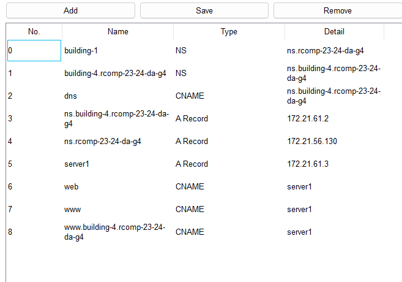

# Project README

---

**Features Implemented:**

- **OSPF**
- **DHCPv4**
- **VoIP**
- **DNS**
- **HTTP & HTTPS**
- **ACLs** :

1. **Spoofing Prevention:** Access control lists (ACLs) are configured to block external spoofing attempts and prevent unauthorized traffic from entering the network.
2. **Traffic Control:** ACLs are used to control traffic flow, allowing only legitimate traffic to pass through the network while blocking unauthorized access.
3. **Security Policies:** ACLs enforce security policies such as blocking all traffic to the DMZ except for DNS and HTTP/HTTPS services, and allowing ICMP echo requests and replies.

## DNS TABLE

