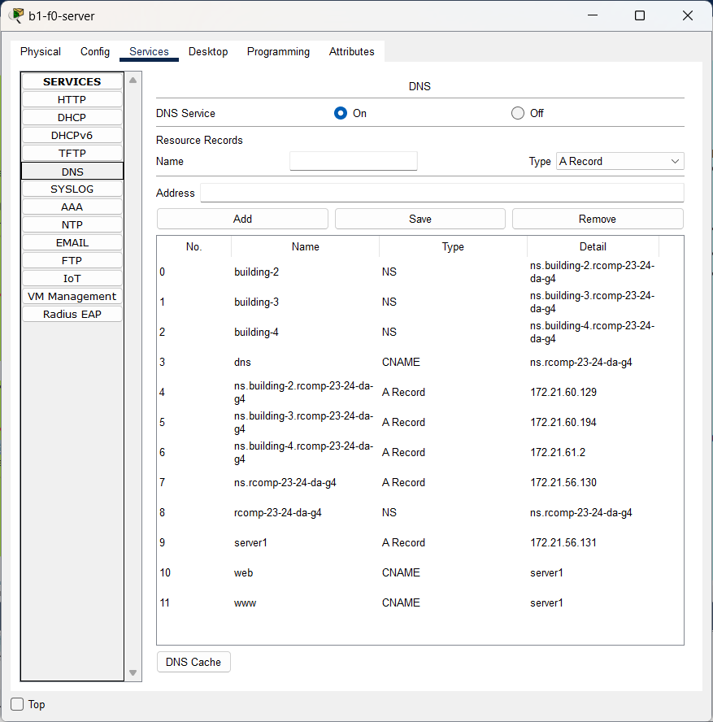

# BUILDING 1

## PACKET TRACER SIMULATION

[building1.pkt](building1.pkt)

## DNS TABLE

## CONFIGURATION FILES 

[b1-f0-hc-switch_running-config.txt](new-configs/b1-f0-hc-switch_running-config.txt)

[b1-f1-hc-switch_running-config.txt](new-configs/b1-f1-hc-switch_running-config.txt)

[b1-ic-switch_running-config.txt](new-configs/b1-ic-switch_running-config.txt)

[b1-router_running-config.txt](new-configs/b1-router_running-config.txt)

